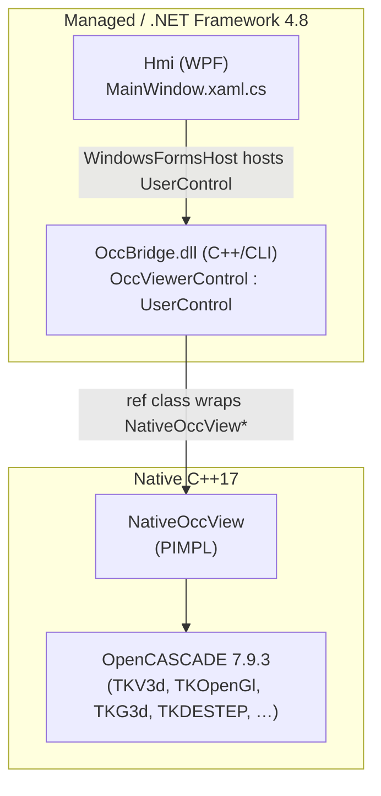
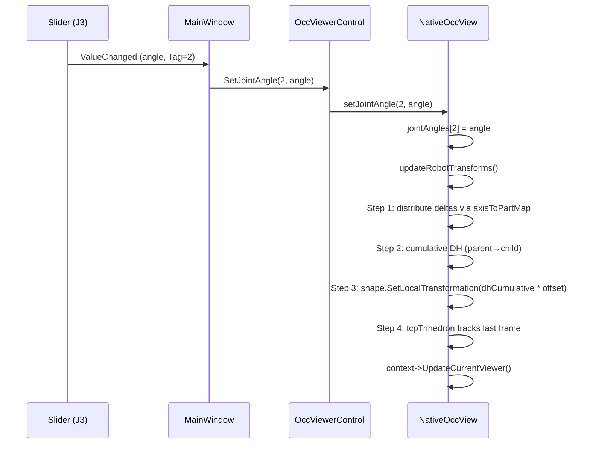

# RobotSimulation — Architecture & Design

A 6-DOF robot arm visualization tool built on **OpenCASCADE Technology (OCCT) 7.9.3** with a **WPF + C++/CLI** stack. The application loads STEP CAD files described by **DH (Denavit–Hartenberg) parameters** in a JSON config, displays them in a 3D viewer, and lets the user articulate the arm with joint sliders.

---

## 1. Feature Summary

| Area | Capability |
|---|---|
| Model loading | Imports a folder containing one `.json` config + multiple `.step` CAD files |
| Kinematics | Standard DH convention, parent/child cumulative transforms, per-axis joint limits from JSON |
| 3D viewer | Mouse rotate (left), pan (middle), zoom (wheel), ISO / Top presets, Fit All |
| Visual cues | Per-axis colored corner trihedron (X=blue, Y=green, Z=red), TCP (Tool Center Point) trihedron tracking the end-effector |
| UI | WPF menu bar (File / View), 6 joint-angle sliders with live degree labels, status bar (green=idle, orange=loading) |
| Persistence | Last imported folder remembered in `HKCU\SOFTWARE\RobotSimulation\LastModelFolder`; auto-loads on startup |
| Progress feedback | "Loading part i/N…" updates pumped through a `DispatcherFrame` to keep the UI responsive |

---

## 2. Solution Layout

```
robot-simulation/
├── Hmi/                          C# WPF front-end (.NET Framework 4.8)
│   ├── App.xaml(.cs)
│   ├── MainWindow.xaml(.cs)
│   └── Hmi.csproj
├── OccBridge/                    C++/CLI bridge DLL (mixed managed/native)
│   ├── OccViewerControl.h/.cpp   ref class : WinForms UserControl
│   ├── NativeOccView.h/.cpp      Pure native OCCT viewer (PIMPL)
│   ├── RobotPartDef.h            Native part definition struct
│   └── OccBridge.vcxproj
├── Occt/                         Vendored OCCT 7.9.3 binaries
├── Props/Local.Occt.props        MSBuild props (OcctIncludeDir, OcctLibDir)
├── Figures/                      App icon (.avif source, .png embedded)
└── docs/ARCHITECTURE.md          (this file)
```

---

## 3. Layered Architecture



**Three layers, each with a single responsibility:**

1. **Hmi (C#/WPF)** — All user interaction: menus, sliders, status bar, JSON parsing, registry persistence. Knows nothing about OCCT types.
2. **OccBridge (C++/CLI)** — Marshalling boundary. Converts managed strings/arrays into native structs, forwards calls. Compiled with `/clr` for the bridge file, `/clr` *off* for `NativeOccView.cpp` (see §6).
3. **NativeOccView (native C++)** — Owns all OCCT handles. Implements kinematics, STEP loading, and the camera/interaction state. Uses the **PIMPL idiom** so the public header has zero OCCT `#include`s.

---

## 4. Class & Object Model

### 4.1 Hmi.MainWindow (C#)

| Member | Role |
|---|---|
| `_viewer : OccViewerControl` | The hosted C++/CLI viewer control |
| `_robotLoaded : bool` | Guards slider events until a model is loaded |
| `_jointLabels : TextBlock[]` | The six `LblJ1..LblJ6` for live degree readout |
| `BrushGreen / BrushOrange` | Status-bar color states |
| `RegistryKey / RegistryValue` | `SOFTWARE\RobotSimulation` / `LastModelFolder` |
| `LoadRobotFromFolder(path)` | Parses JSON → builds `RobotPartInfo[]` → calls `_viewer.LoadRobotArm` |
| `ShowFolderDialog(title)` | Vista `IFileOpenDialog` COM interop (auto-remembers last folder) |
| `Slider_ValueChanged` | Forwards `axisIndex, angleDeg` to `_viewer.SetJointAngle` |
| `GetLastModelFolder / SetLastModelFolder` | Registry persistence |

JSON format (per part):
```json
{
  "CadFilePath": "...\\base.step",
  "a": 0, "alpha": 0, "d": 89.2, "theta": 0,
  "Offset": "[0,0,0,0,0,0]",
  "ParentDHIdx": -1,
  "CadColor": "[200,200,200]"
}
```
Plus top-level keys: `PartInfos[]`, `AxisToPartMap` ( `[[axis, partIdx], …]` ), optional `AxisLimits`.

### 4.2 OccBridge.OccViewerControl (C++/CLI `ref class`)

Inherits `System.Windows.Forms.UserControl` and is hosted in WPF via `WindowsFormsHost`.

| Member | Role |
|---|---|
| `NativeOccView* _native` | Owned native viewer (deleted in finalizer `!OccViewerControl`) |
| `bool _initialized` | OCCT init is deferred until `OnHandleCreated` (HWND must exist) |
| `LoadStep(path, append)` | Marshals `String^` → `wstring` → native |
| `LoadRobotArm(parts, map, progress)` | Three-phase: `beginRobotArm` → loop `loadRobotPart` (invoking progress) → `endRobotArm` |
| `SetJointAngle` / `FitAllView` / `SetViewIso` / `SetViewTop` / `ClearScene` | Thin forwarders |
| `OnMouseDown/Move/Up/Wheel` | Force-focus + forward to native |
| `OnPaint / OnResize` | Forward to `redraw` / `resize` |

`RobotPartInfo` is a public `ref class` carrying the JSON-parsed fields across the managed boundary.

### 4.3 NativeOccView (native C++)

Public API hides everything OCCT-related behind PIMPL:
```cpp
class NativeOccView {
public:
    void initialize(HWND);
    [[nodiscard]] bool loadStep(const wchar_t*, bool append);
    [[nodiscard]] bool beginRobotArm(const RobotPartDef*, int, const int*, int);
    [[nodiscard]] bool loadRobotPart(int);
    void endRobotArm();
    void setJointAngle(int axisIndex, double angleDeg);
    void clearScene();
    void fitAll(); void setViewIso(); void setViewTop();
    void onMouseDown/Move/Up/Wheel(...);
private:
    void updateRobotTransforms();
    struct Impl;
    Impl* m_impl;
};
```

`Impl` holds:
| Field | Purpose |
|---|---|
| `displayConnection, graphicDriver, viewer, view, context` | OCCT rendering stack |
| `shapes : vector<Handle(AIS_Shape)>` | One AIS object per part (null slot if load failed) |
| `originalShapes : vector<TopoDS_Shape>` | Untransformed geometry (parallel to `shapes`) |
| `partDefs : vector<RobotPartDef>` | DH params + offsets + colors |
| `axisToPartMap : vector<pair<int,int>>` | `(axisIndex, partIndex)` pairs |
| `jointAngles : vector<double>` | Always size 6 |
| `tcpTrihedron : Handle(AIS_Trihedron)` | Follows the last DH frame |
| `hwnd, lastX, lastY, isRotating, isPanning` | Win32 + interaction state |

### 4.4 RobotPartDef (native struct)
```cpp
struct RobotPartDef {
    std::wstring filePath;
    double dhA, dhAlpha, dhD, dhTheta;
    double offset[6];      // tx, ty, tz, rx_deg, ry_deg, rz_deg
    int parentIdx;         // -1 for root
    int colorR, colorG, colorB;
};
```

---

## 5. Key Sequences

### 5.1 Startup → Auto-load

```mermaid
sequenceDiagram
    participant U as User
    participant W as MainWindow
    participant V as OccViewerControl
    participant N as NativeOccView

    W->>W: ctor: read HKCU LastModelFolder
    W->>V: new OccViewerControl()
    V->>N: new NativeOccView()
    Note over W: WPF Loaded event
    W->>W: LoadRobotFromFolder(lastFolder)
    W->>V: LoadRobotArm(parts, map, progress)
    V->>N: beginRobotArm(...)
    loop for each part i
        V->>W: progress(i+1, n)  →  SetStatus("Loading i/n…", orange)
        V->>N: loadRobotPart(i)
    end
    V->>N: endRobotArm()  // creates TCP trihedron, fitAll
    W->>W: SetStatus("Loaded: …", green); SetLastModelFolder()
```

### 5.2 Joint slider movement



---

## 6. Build / Compilation Notes

### `OccBridge.vcxproj` highlights

- **Project-wide:** `CompileAsManaged=true`, `ExceptionHandling=false` (required for `/clr`).
- **Per-file override** on `NativeOccView.cpp`:
  ```xml
  <CompileAsManaged>false</CompileAsManaged>
  <ExceptionHandling>Sync</ExceptionHandling>
  ```
  Why: `Geom_Axis2Placement` (and other non-inline OCCT classes) exports use the **native** name-mangling. Compiling `NativeOccView.cpp` with `/clr` produces `$$F`-mangled symbols that cannot link against `TKG3d.lib`. The override compiles only this file as pure native.
- **Compile flags:** `/utf-8 /FS`
- **Linked OCCT libs:** `TKernel, TKMath, TKG3d, TKService, TKV3d, TKOpenGl, TKBRep, TKTopAlgo, TKDE, TKDESTEP, TKXSBase`
- **Output:** `$(SolutionDir)bin\$(Configuration)\OccBridge.dll`. A post-build step copies OCCT runtime DLLs alongside `Hmi.exe`.

### `Hmi.csproj` highlights

- .NET Framework 4.8, `x64` only.
- Robot icon: `Figures/robot-icon.png` as `<Resource>`, set via `Icon = new BitmapImage(...)` in code-behind (an embedded ICO triggered `XamlParseException` at parse time, so PNG is used).
- References `OccBridge.dll`, `System.Web.Extensions` (for `JavaScriptSerializer`).

---

## 7. Kinematics in Depth

For each part `i`:

$$
T_i^{\text{local}} = R_z(\theta_i + \Delta\theta_i)\, T_z(d_i)\, T_x(a_i)\, R_x(\alpha_i)
$$

where $\Delta\theta_i$ is the joint angle from the slider for the axis mapped to part `i` (0 if the part is not joint-driven).

Cumulative transform along the chain:

$$
T_i^{\text{cum}} = T_{\text{parent}(i)}^{\text{cum}} \cdot T_i^{\text{local}}, \quad T_{\text{root}}^{\text{cum}} = T_{\text{root}}^{\text{local}}
$$

The CAD geometry is authored in its own frame, so a fixed **offset transform** brings it into the DH joint frame:

$$
T_i^{\text{offset}} = T(t_x, t_y, t_z) \cdot R_z(r_z) \cdot R_y(r_y) \cdot R_x(r_x)
$$

Final world placement applied via `AIS_Shape::SetLocalTransformation`:

$$
T_i^{\text{world}} = T_i^{\text{cum}} \cdot T_i^{\text{offset}}
$$

The TCP trihedron is placed at $T_{n-1}^{\text{cum}}$ (last DH frame, conventionally the end-effector).

> **Implementation note:** OCCT's `gp_Trsf::Multiply(other)` is post-multiplication (`this = this * other`), so the order of `Multiply` calls in `makeDhTransform` reads left-to-right.

---

## 8. Threading & UI Responsiveness

- All OCCT calls happen on the **WPF UI thread**.
- Long STEP loads would freeze the UI, so loading is split into `beginRobotArm` → N × `loadRobotPart` → `endRobotArm`.
- Between parts, the bridge invokes the C# progress callback. The callback uses a `DispatcherFrame`:
  ```csharp
  SetStatus($"Loading part {current}/{total}...", true);
  var frame = new DispatcherFrame();
  Dispatcher.CurrentDispatcher.BeginInvoke(DispatcherPriority.Background,
      new Action(() => frame.Continue = false));
  Dispatcher.PushFrame(frame);
  ```
  This pumps pending paint messages so the status bar actually updates between parts (a plain `Dispatcher.Invoke` was not sufficient).

---

## 9. Coding Conventions

- C++17, brace style `if( cond ) {` (spaces inside parens), `array[ i ]`, `for( ... ) {`, `(void)` for no-arg native functions.
- Header files in `OccBridge/` contain **no** `#include` directives — types are forward-declared and OCCT is hidden behind PIMPL.
- Inline comments live between the function signature and the opening brace.
- C# follows the same spacing rules; `void` parameter syntax is not used (unsupported in C#).
- All UI strings are English.

---

## 10. Extension Points

| To add … | Touch |
|---|---|
| A new view preset | `NativeOccView::setViewXxx` + `OccViewerControl::SetViewXxx` + a `MenuItem` in `MainWindow.xaml` |
| 7th axis | Increase `jointAngles` size + `SetJointAngle` bounds in `NativeOccView`; add `SliderJ7`; relax `axisIdx <= 6` check |
| Forward kinematics readout | Expose `dhCumulative.back()` as a 4×4 matrix via the bridge |
| Inverse kinematics | New native module consuming `partDefs` + a target pose; call `setJointAngle` for each solved axis |
| Collision detection | `BRepExtrema_DistShapeShape` on pairs of `originalShapes` after applying their cumulative transform |
