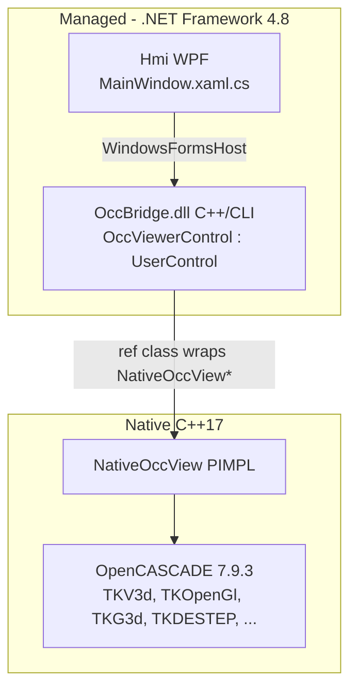
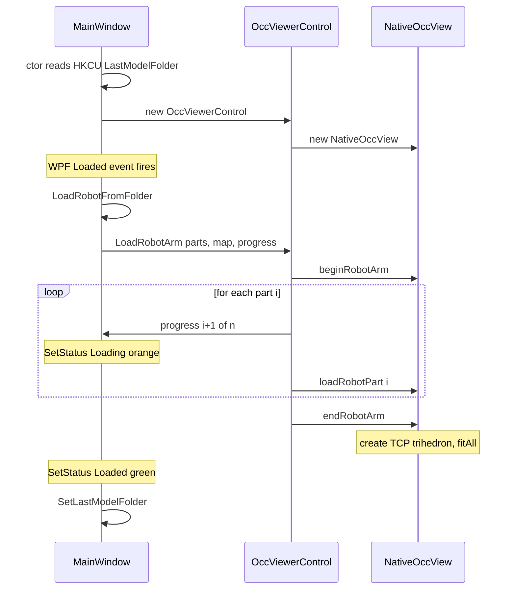
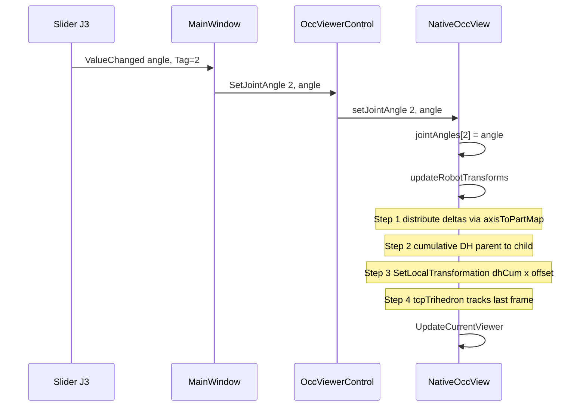

# RobotSimulation

A 6-DOF industrial robot arm visualizer built with **WPF + C++/CLI + OpenCASCADE Technology (OCCT) 7.9.3**. Loads STEP CAD parts described by **Denavit–Hartenberg (DH) parameters** in a JSON configuration file, renders them in an interactive 3D scene, and lets the user articulate each joint with sliders in real time.


---

## Features

- **Import a robot model** from a folder containing `*.step` parts and one `*.json` config (DH params, axis limits, color, parent-child links).
- **Forward kinematics** with standard DH convention and parent-child cumulative transforms.
- **Six joint sliders** with axis limits read from JSON; live degree readout per joint.
- **Per-axis colored trihedrons** — base frame in the corner (X=blue, Y=green, Z=red) and a TCP (Tool Center Point) trihedron that tracks the end-effector in real time.
- **3D interaction** — left-button rotate, middle-button pan, mouse-wheel zoom, ISO/Top presets, Fit All.
- **Loading progress** displayed part-by-part on a colored status bar (orange = loading, green = idle).
- **Auto-resume** — the last imported folder is stored in the registry and loaded on next startup.

---

## Project Layout

```
robot-simulation/
├── RobotSimulation.sln
├── Hmi/                     C# WPF front-end (.NET Framework 4.8, x64)
│   ├── App.xaml(.cs)
│   ├── MainWindow.xaml      Menu bar, sliders, status bar, WindowsFormsHost
│   ├── MainWindow.xaml.cs   JSON parsing, registry, IFileOpenDialog COM interop
│   └── Hmi.csproj
├── OccBridge/               C++/CLI bridge DLL (mixed managed + native)
│   ├── OccViewerControl.h/.cpp   ref class : WinForms UserControl (managed)
│   ├── NativeOccView.h/.cpp      Pure native OCCT viewer (PIMPL)
│   ├── RobotPartDef.h            Native part definition struct
│   └── OccBridge.vcxproj
├── Props/Local.Occt.props   MSBuild props (OcctIncludeDir, OcctLibDir)
├── Occt/                    Vendored OCCT 7.9.3 binaries (gitignored)
├── Data/CadFiles/           Sample robot models (R-LA906-7, R-LA580-4)
├── Figures/                 App icon (.avif source, .png embedded)
├── Docs/                    Architecture documentation
└── bin/                     Build output
```

---

## Architecture

Three layers with strict separation of concerns:



| Layer | Responsibility |
|---|---|
| **Hmi (C#/WPF)** | UI, menus, sliders, status bar, JSON parsing, registry persistence, folder dialog. No OCCT types. |
| **OccBridge (C++/CLI)** | Marshalling boundary. Converts managed strings/arrays into native structs and forwards calls. |
| **NativeOccView (native C++)** | Owns all OCCT handles. Implements kinematics, STEP loading, camera, interaction. Headers contain **zero** `#include` directives — OCCT is hidden behind PIMPL. |

---

## Class Model

### `Hmi.MainWindow`
- `_viewer : OccViewerControl` — the hosted C++/CLI control
- `_robotLoaded`, `_jointLabels` — UI state
- `LoadRobotFromFolder(path)` — parses JSON, builds `RobotPartInfo[]`, calls `_viewer.LoadRobotArm`
- `ShowFolderDialog(title)` — Vista `IFileOpenDialog` COM interop (Windows auto-remembers last folder per-app)
- `GetLastModelFolder / SetLastModelFolder` — registry persistence at `HKCU\SOFTWARE\RobotSimulation\LastModelFolder`

### `OccBridge.OccViewerControl` (ref class : `UserControl`)
- `NativeOccView* _native` — released in finalizer `!OccViewerControl`
- `_initialized` — OCCT init is deferred until `OnHandleCreated` (HWND must exist)
- Public methods: `LoadStep`, `LoadRobotArm`, `SetJointAngle`, `ClearScene`, `FitAllView`, `SetViewIso`, `SetViewTop`
- Overrides: `OnHandleCreated`, `OnResize`, `OnPaint`, `OnMouseDown/Move/Up/Wheel`

### `OccBridge.RobotPartInfo` (managed ref class)
Carries JSON-parsed fields across the managed/native boundary: `FilePath`, `DH_a/alpha/d/theta`, `Offset[6]`, `ParentIdx`, `ColorR/G/B`.

### `NativeOccView` (native C++, PIMPL)
Public API hides OCCT entirely:
```cpp
class NativeOccView {
public:
    void initialize(HWND);
    [[nodiscard]] bool loadStep(const wchar_t*, bool append);
    [[nodiscard]] bool beginRobotArm(const RobotPartDef*, int, const int*, int);
    [[nodiscard]] bool loadRobotPart(int);
    void endRobotArm();
    void setJointAngle(int axisIndex, double angleDeg);
    void clearScene();
    void fitAll(); void setViewIso(); void setViewTop();
    void onMouseDown/Move/Up/Wheel(...);
private:
    void updateRobotTransforms();
    struct Impl; Impl* m_impl;
};
```

`Impl` (defined in `.cpp`) holds:

| Field | Purpose |
|---|---|
| `displayConnection, graphicDriver, viewer, view, context` | OCCT rendering stack |
| `shapes : vector<Handle(AIS_Shape)>` | One AIS object per part (null slot on load failure) |
| `originalShapes : vector<TopoDS_Shape>` | Untransformed geometry, parallel to `shapes` |
| `partDefs : vector<RobotPartDef>` | DH params, offsets, colors |
| `axisToPartMap : vector<pair<int,int>>` | (axisIndex, partIndex) pairs |
| `jointAngles : vector<double>` | Always size 6 |
| `tcpTrihedron : Handle(AIS_Trihedron)` | Follows the last DH frame |
| `hwnd, lastX, lastY, isRotating, isPanning` | Win32 + mouse interaction state |

### `RobotPartDef` (native POD struct)
```cpp
struct RobotPartDef {
    std::wstring filePath;
    double dhA, dhAlpha, dhD, dhTheta;
    double offset[6];    // tx, ty, tz, rx_deg, ry_deg, rz_deg
    int parentIdx;       // -1 for root
    int colorR, colorG, colorB;
};
```

---

## Kinematics

For each part $i$, the local DH transform follows the standard convention:

$$
T_i^{\text{local}} = R_z(\theta_i + \Delta\theta_i)\, T_z(d_i)\, T_x(a_i)\, R_x(\alpha_i)
$$

where $\Delta\theta_i$ is the slider-driven joint angle for the axis mapped to part $i$ (0 if the part is not joint-driven).

Cumulative transform along the parent chain:

$$
T_i^{\text{cum}} = T_{\text{parent}(i)}^{\text{cum}} \cdot T_i^{\text{local}}
$$

A fixed **offset transform** brings the CAD shape's authored frame into the DH joint frame:

$$
T_i^{\text{offset}} = T(t_x, t_y, t_z) \cdot R_z(r_z) \cdot R_y(r_y) \cdot R_x(r_x)
$$

Final world placement applied via `AIS_Shape::SetLocalTransformation`:

$$
T_i^{\text{world}} = T_i^{\text{cum}} \cdot T_i^{\text{offset}}
$$

The TCP trihedron is placed at $T_{n-1}^{\text{cum}}$ (the last DH frame, conventionally the end-effector).

> **Note:** OCCT's `gp_Trsf::Multiply(other)` post-multiplies (`this = this * other`), so the order of `Multiply` calls in code reads left-to-right.

---

## Key Sequences

### Startup with auto-load



### Joint slider movement



---

## JSON Model Format

The model folder must contain exactly one `*.json` file plus the referenced `*.step` files (resolved by **filename only** relative to the JSON folder):

```json
{
  "Name": "R-LA906-7",
  "AxisNum": 6,
  "AxisLimits": "[[-170,170],[-96,130],[-195,65],[-170,170],[-120,120],[-360,360]]",
  "AxisToPartMap": "[[1,1],[2,2],[3,3],[4,4],[5,5],[6,6]]",
  "PartInfos": [
    {
      "CadFilePath": "...\\R-LA906-7_BASE.step",
      "CadColor": "[42,41,42]",
      "Offset": "[0,0,0,0,0,0]",
      "ParentDHIdx": -1,
      "a": 0, "alpha": 0, "d": 0, "theta": 0
    },
    {
      "CadFilePath": "...\\R-LA906-7_1.step",
      "CadColor": "[241,240,234]",
      "Offset": "[0,0,0,90,0,0]",
      "ParentDHIdx": 0,
      "a": 30, "alpha": -90, "d": 380, "theta": 0
    }
  ]
}
```

| Field | Meaning |
|---|---|
| `AxisLimits` | Per-axis `[min_deg, max_deg]`; applied to sliders on load. |
| `AxisToPartMap` | `[axis_index_1_based, part_index_0_based]` pairs. |
| `Offset` | `[tx, ty, tz, rx_deg, ry_deg, rz_deg]` from CAD authored frame to DH joint frame. |
| `ParentDHIdx` | Parent part index; `-1` marks root. Parts must be listed in topological order. |
| `a, alpha, d, theta` | Standard DH parameters (distances in mm, angles in degrees). |

Sample models in `Data/CadFiles/`: `R-LA906-7` and `R-LA580-4`.

---

## Build

### Prerequisites

- **Visual Studio 2022 Professional** (toolset v143) with:
  - .NET Framework 4.8 SDK
  - Desktop development with C++
  - C++/CLI support
- **OCCT 7.9.3 vc14 x64** binary distribution placed at `Occt/opencascade-7.9.3-vc14-64/` (path configured in `Props/Local.Occt.props`)

### Steps

1. Open `RobotSimulation.sln` in Visual Studio.
2. Select **Debug | x64** or **Release | x64** (32-bit is unsupported).
3. Build → `OccBridge.dll` then `Hmi.exe` land in `bin/Debug/` (or `bin/Release/`). A post-build step copies all OCCT and third-party runtime DLLs (FreeType, TBB, FreeImage, FFmpeg, jemalloc, OpenVR) into the output folder.
4. Run `Hmi.exe`. Use **File → Import Model** to pick `Data/CadFiles/R-LA906-7/` for a quick test.

### Build Notes

- `OccBridge.vcxproj` is a mixed-mode project. The whole project compiles with `/clr`, **except** `NativeOccView.cpp` which has a per-file override:
  ```xml
  <CompileAsManaged>false</CompileAsManaged>
  <ExceptionHandling>Sync</ExceptionHandling>
  ```
  This is required because OCCT classes such as `Geom_Axis2Placement` export native-mangled symbols that cannot be resolved by `/clr` translation units (which add a `$$F` to the mangle, producing `LNK2028`).
- Compiler flags: `/utf-8 /FS`. Warning `4996` suppressed (OCCT uses deprecated `std::iterator` traits).
- OCCT libraries linked: `TKernel, TKMath, TKG3d, TKService, TKV3d, TKOpenGl, TKBRep, TKTopAlgo, TKDE, TKDESTEP, TKXSBase`. Note that `Geom_*` classes belong to **TKG3d**, not `TKGeomBase`.
- Hmi window icon comes from `Figures/robot-icon.png` (embedded as `<Resource>`, set in code-behind — an ICO file triggered `XamlParseException`).

---

## Threading & UI Responsiveness

All OCCT calls run on the WPF UI thread. To avoid freezing during large STEP loads, the bridge splits `LoadRobotArm` into three phases:

1. `beginRobotArm` — stores metadata
2. Loop calling `loadRobotPart(i)` — loads one STEP file per call, invoking the progress callback between parts
3. `endRobotArm` — finalizes transforms + creates TCP trihedron

The progress callback uses a `DispatcherFrame` to pump pending paint messages so the status bar visibly updates between parts:

```csharp
var frame = new DispatcherFrame();
Dispatcher.CurrentDispatcher.BeginInvoke(DispatcherPriority.Background,
    new Action(() => frame.Continue = false));
Dispatcher.PushFrame(frame);
```

A plain `Dispatcher.Invoke` is **not** sufficient — it queues without flushing the render queue.

---

## Coding Conventions

- **C++17**, brace style `if( cond ) {` with spaces inside parens, `array[ i ]` with spaces inside brackets, `for( ... ) {` on one line, `( void )` for no-argument functions.
- **Headers in `OccBridge/` contain no `#include` directives** — types are forward-declared and OCCT is hidden behind PIMPL.
- Inline summary comments live **between the function signature and the opening brace**, not before the signature.
- **C#** follows the same spacing rules; `void` parameter syntax is omitted (unsupported in C#).
- All UI strings in English.

---

## Extension Points

| To add ... | Touch ... |
|---|---|
| A new view preset | `NativeOccView::setViewXxx` + `OccViewerControl::SetViewXxx` + a `MenuItem` in `MainWindow.xaml` |
| 7th axis | Increase `jointAngles` size and `SetJointAngle` bounds in `NativeOccView`; add `SliderJ7` |
| Forward kinematics readout | Expose `dhCumulative.back()` as a 4×4 matrix via the bridge |
| Inverse kinematics | New native module consuming `partDefs` + a target pose; call `setJointAngle` for each solved axis |
| Collision detection | `BRepExtrema_DistShapeShape` on pairs of `originalShapes` after applying their cumulative transform |

---

## License

This repository contains a runtime copy of OpenCASCADE Technology (LGPL-2.1 with OCCT exception). See `Occt/opencascade-7.9.3-vc14-64/LICENSE_LGPL_21.txt` and `OCCT_LGPL_EXCEPTION.txt`.
