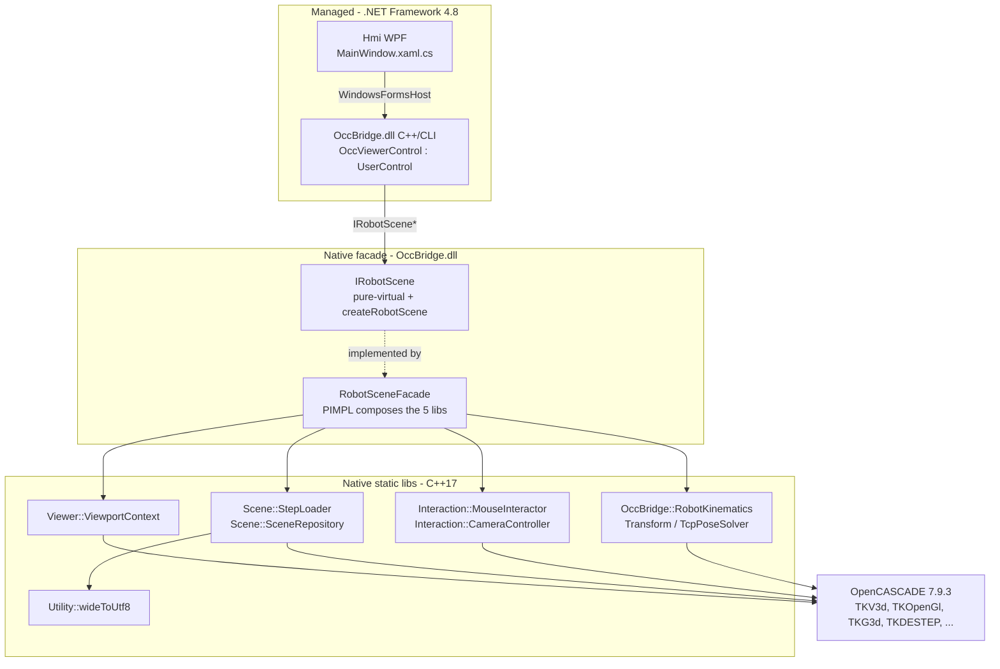
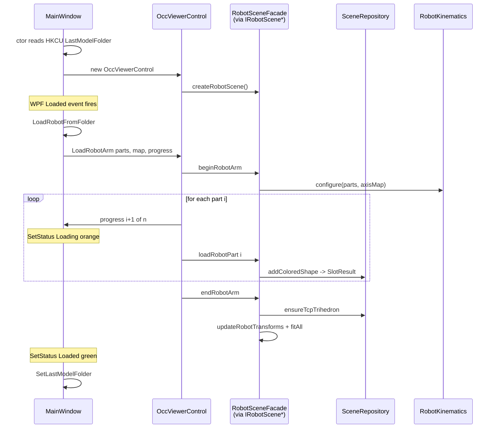
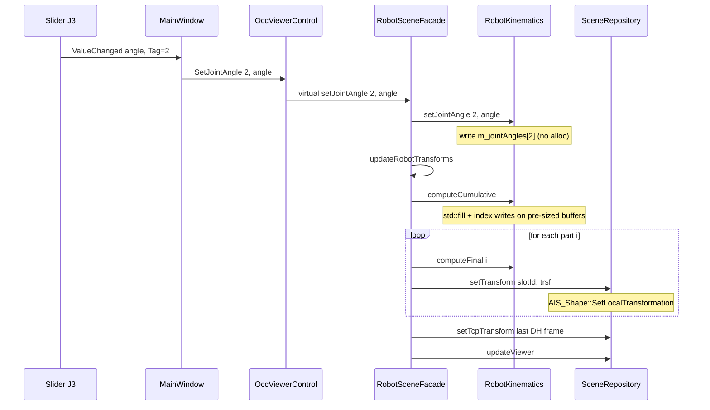

# RobotSimulation

A 6-DOF industrial robot arm visualizer built with **WPF + C++/CLI + OpenCASCADE Technology (OCCT) 7.9.3**. Loads STEP CAD parts described by **Denavit–Hartenberg (DH) parameters** in a JSON configuration file, renders them in an interactive 3D scene, and lets the user articulate each joint with sliders in real time.


---

## Features

- **Import a robot model** from a folder containing `*.step` parts and one `*.json` config (DH params, axis limits, color, parent-child links).
- **Forward kinematics** with standard DH convention and parent-child cumulative transforms.
- **Six joint sliders** with axis limits read from JSON; live degree readout per joint.
- **Per-axis colored trihedrons** — base frame in the corner (X=blue, Y=green, Z=red) and a TCP (Tool Center Point) trihedron that tracks the end-effector in real time.
- **3D interaction** — left-button rotate, middle-button pan, mouse-wheel zoom, ISO/Top presets, Fit All.
- **Loading progress** displayed part-by-part on a colored status bar (orange = loading, green = idle).
- **Auto-resume** — the last imported folder is stored in the registry and loaded on next startup.

---

## Project Layout

```
robot-simulation/
├── RobotSimulation.sln
├── Hmi/                       C# WPF front-end (.NET Framework 4.8, x64)
│   ├── App.xaml(.cs)
│   ├── MainWindow.xaml        Menu bar, sliders, status bar, WindowsFormsHost
│   ├── MainWindow.xaml.cs     JSON parsing, registry, IFileOpenDialog COM interop
│   ├── Controls/StatusDashboard.xaml(.cs)
│   └── Hmi.csproj
├── OccBridge/                 C++/CLI bridge DLL (mixed managed + native facade)
│   ├── OccViewerControl.h/.cpp    ref class : WinForms UserControl (managed)
│   ├── IRobotScene.h              Pure-virtual facade interface + createRobotScene()
│   ├── RobotSceneFacade.h/.cpp    Concrete IRobotScene composing the 5 helper libs (PIMPL)
│   └── OccBridge.vcxproj
├── Viewer/                    Static lib — OCCT rendering stack (ViewportContext)
├── Scene/                     Static lib — STEP loading (StepLoader) + AIS slot mgmt (SceneRepository)
├── Interaction/               Static lib — MouseInteractor + CameraController
├── Kinematics/                Static lib — DH math (TransformBuilder), TCP pose (TcpPoseSolver),
│                              forward kinematics solver (RobotKinematics), RobotPartDef POD
├── Utility/                   Static lib — StringUtil (wideToUtf8)
├── Props/Local.Occt.props     MSBuild props (OcctIncludeDir, OcctLibDir, OcctRoot, OcctThirdPartyRoot)
├── Occt/                      Vendored OCCT 7.9.3 binaries (gitignored)
├── Data/CadFiles/             Sample robot models (R-LA906-7, R-LA580-4)
├── Figures/                   App icon (.avif source, .png embedded)
├── Docs/                      Architecture docs + RefactoringRoadmap.md (R0..R8 plan)
└── bin/                       Build output
```

---

## Architecture

Four layers, with the native side split into a thin facade plus five single-responsibility static libraries. The managed wrapper depends only on the abstract `IRobotScene` interface (DIP).


```mermaid
flowchart TB
    subgraph Managed[Managed - .NET Framework 4.8]
        UI[Hmi WPF<br/>MainWindow.xaml.cs]
        Bridge[OccBridge.dll C++/CLI<br/>OccViewerControl : UserControl]
    end
    subgraph Facade[Native facade - OccBridge.dll]
        IRS[IRobotScene<br/>pure-virtual + createRobotScene]
        RSF[RobotSceneFacade<br/>PIMPL composes the 5 libs]
    end
    subgraph Libs[Native static libs - C++17]
        VW[Viewer::ViewportContext]
        SC[Scene::StepLoader<br/>Scene::SceneRepository]
        IN[Interaction::MouseInteractor<br/>Interaction::CameraController]
        KN[OccBridge::RobotKinematics<br/>Transform / TcpPoseSolver]
        UT[Utility::wideToUtf8]
    end
    OCCT[OpenCASCADE 7.9.3<br/>TKV3d, TKOpenGl, TKG3d, TKDESTEP, ...]

    UI -- WindowsFormsHost --> Bridge
    Bridge -- IRobotScene* --> IRS
    IRS -. implemented by .-> RSF
    RSF --> VW
    RSF --> SC
    RSF --> IN
    RSF --> KN
    SC --> UT
    VW --> OCCT
    SC --> OCCT
    IN --> OCCT
    KN --> OCCT
```

| Layer | Responsibility |
|---|---|
| **Hmi (C#/WPF)** | UI, menus, sliders, status bar, JSON parsing, registry persistence, folder dialog. No OCCT types. |
| **OccBridge (C++/CLI)** | Marshalling boundary. `OccViewerControl` holds `IRobotScene*` from `createRobotScene()` — never names the concrete facade. |
| **RobotSceneFacade (native)** | Implements `IRobotScene`; orchestrates the 5 helper libraries via PIMPL. ~270 lines, single-responsibility forwards. |
| **Viewer / Scene / Interaction / Kinematics / Utility** | Single-purpose static libs. Each owns its slice of OCCT or pure math; tested independently. |

---

## Class Model

### `Hmi.MainWindow`
- `_viewer : OccViewerControl` — the hosted C++/CLI control
- `_robotLoaded`, `_jointLabels`, `_jogTimer` — UI state
- `LoadRobotFromFolder(path)` — parses JSON, builds `RobotPartInfo[]`, calls `_viewer.LoadRobotArm`
- `JogTimer_Tick` — polls `_viewer.GetTcpPose()` while jogging and pushes the result to `StatusDashboard`
- `ShowFolderDialog(title)` — Vista `IFileOpenDialog` COM interop (Windows auto-remembers last folder per-app)
- `GetLastModelFolder / SetLastModelFolder` — registry persistence at `HKCU\SOFTWARE\RobotSimulation\LastModelFolder`

### `OccBridge::OccViewerControl` (ref class : `UserControl`)
- `IRobotScene* m_pNative` — obtained from `createRobotScene()`; released in finalizer `!OccViewerControl`. Wrapper never names `RobotSceneFacade` directly.
- `m_bInitialized` — OCCT init is deferred until `OnHandleCreated` (HWND must exist)
- Public methods: `LoadStep`, `LoadRobotArm`, `SetJointAngle`, `GetTcpPose`, `ClearScene`, `FitAllView`, `SetViewIso`, `SetViewTop`
- Overrides: `OnHandleCreated`, `OnResize`, `OnPaint`, `OnMouseDown/Move/Up/Wheel`

### `OccBridge::RobotPartInfo` (managed ref class)
Carries JSON-parsed fields across the managed/native boundary: `FilePath`, `DH_a/alpha/d/theta`, `Offset[6]`, `ParentIdx`, `ColorR/G/B`. Marshalled into the native `RobotPartDef` POD in `LoadRobotArm`.

### `OccBridge::IRobotScene` (abstract interface)
Forward-declares `HWND` and `RobotPartDef` only; no OCCT headers. Defines 17 pure-virtual methods mirroring the facade's public surface, plus a free-function factory:

```cpp
[[nodiscard]] IRobotScene* createRobotScene();
```

Returns a raw pointer rather than `unique_ptr` because C++/CLI ref classes cannot hold `std::unique_ptr` member fields.

### `OccBridge::RobotSceneFacade` (concrete `IRobotScene`, PIMPL)
Public API hides OCCT entirely; the implementation composes five helpers and a `partToSlot` map (part index → `SceneRepository` slot; `-1` = load failure):

```cpp
struct RobotSceneFacade::Impl {
    Viewer::ViewportContext       viewport;
    Scene::SceneRepository        repo;
    Interaction::MouseInteractor  mouse;
    Interaction::CameraController camera;
    OccBridge::RobotKinematics    kin;
    std::vector<int>              partToSlot;
};
```

Every `override` is a one-or-two-line forward to one of the helpers; `updateRobotTransforms` is the only non-trivial private method.

### `Viewer::ViewportContext`
Owns the OCCT rendering stack (`Aspect_DisplayConnection`, `OpenGl_GraphicDriver`, `V3d_Viewer`, `V3d_View`, `AIS_InteractiveContext`, `HWND`). Methods: `initialize(HWND)`, `resize`, `redraw`, `view()`, `context()`. Sets up default lights, gray30 background, lower-left corner trihedron, and the initial isometric projection.

### `Scene::StepLoader`
Single method `[[nodiscard]] std::optional<TopoDS_Shape> read(std::wstring_view path)`. Uses `Utility::wideToUtf8` then `STEPControl_Reader`; returns `std::nullopt` on any failure (no exceptions).

### `Scene::SceneRepository`
Owns `vector<Handle(AIS_Shape)>` plus an optional TCP `AIS_Trihedron`. Returns a `SlotResult { int slotId; bool isValid; }` from `addShape` / `addColoredShape` so failures never shift other slots. Methods: `attach(ctx)`, `addShape`, `addColoredShape`, `setTransform(slotId, trsf)`, `ensureTcpTrihedron()`, `setTcpTransform`, `tcpFrame()`, `clear`, `updateViewer`.

### `Interaction::MouseInteractor`
State machine for rotate / pan / wheel. `enum class MouseButton { Left = 1048576, Middle = 4194304 };` matches the WinForms bitmask values forwarded by `OccViewerControl`. Methods: `attach(view, context)`, `onMouseDown/Move/Up/Wheel`.

### `Interaction::CameraController`
`attach(view)`, `setViewIso()` (V3d_XposYnegZpos + fitAll), `setViewTop()` (V3d_Zpos + fitAll), `fitAll()` (FitAll + ZFitAll + Redraw).

### `OccBridge::RobotKinematics`
Forward-kinematics solver. Pre-allocates `m_partJointDelta`, `m_dhCumulative`, and `std::array<double, 6> m_jointAngles` once in `configure()` so `setJointAngle` → `computeCumulative` stays heap-allocation-free in the steady state. Methods: `configure`, `setJointAngle`, `computeCumulative`, `computeFinal`, `tcpFrame`, `parts()`.

### `OccBridge::Transform` / `OccBridge::solveTcpPose`
Pure functions in `Kinematics/TransformBuilder.h` and `Kinematics/TcpPoseSolver.h`. `Transform::makeDh(a, alpha, d, theta)` and `Transform::makeOffset(tx, ty, tz, rx, ry, rz)` return `gp_Trsf` by value. `solveTcpPose(gp_Trsf)` decomposes to `std::array<double, 6>` `[x, y, z, rx, ry, rz]` in mm + degrees (ZYX intrinsic Euler, gimbal-lock safe).

### `RobotPartDef` (native POD struct, in `Kinematics/`)
```cpp
struct RobotPartDef {
    std::wstring filePath;
    double dhA = 0.0, dhAlpha = 0.0, dhD = 0.0, dhTheta = 0.0;
    double offset[6] = {};    // tx, ty, tz, rx_deg, ry_deg, rz_deg
    int parentIdx = -1;       // -1 for root
    int colorR = 200, colorG = 200, colorB = 200;
};
```

### `Utility::wideToUtf8`
`std::string wideToUtf8(const wchar_t*)` and a `std::wstring_view` overload. Uses Win32 `WideCharToMultiByte`. Called only on STEP load (cold path).

---

## Kinematics

For each part $i$, the local DH transform follows the standard convention:

$$
T_i^{\text{local}} = R_z(\theta_i + \Delta\theta_i)\, T_z(d_i)\, T_x(a_i)\, R_x(\alpha_i)
$$

where $\Delta\theta_i$ is the slider-driven joint angle for the axis mapped to part $i$ (0 if the part is not joint-driven).

Cumulative transform along the parent chain:

$$
T_i^{\text{cum}} = T_{\text{parent}(i)}^{\text{cum}} \cdot T_i^{\text{local}}
$$

A fixed **offset transform** brings the CAD shape's authored frame into the DH joint frame:

$$
T_i^{\text{offset}} = T(t_x, t_y, t_z) \cdot R_z(r_z) \cdot R_y(r_y) \cdot R_x(r_x)
$$

Final world placement applied via `AIS_Shape::SetLocalTransformation`:

$$
T_i^{\text{world}} = T_i^{\text{cum}} \cdot T_i^{\text{offset}}
$$

The TCP trihedron is placed at $T_{n-1}^{\text{cum}}$ (the last DH frame, conventionally the end-effector).

> **Note:** OCCT's `gp_Trsf::Multiply(other)` post-multiplies (`this = this * other`), so the order of `Multiply` calls in code reads left-to-right.

---

## Key Sequences

### Startup with auto-load


```mermaid
sequenceDiagram
    participant W as MainWindow
    participant V as OccViewerControl
    participant F as RobotSceneFacade<br/>(via IRobotScene*)
    participant R as SceneRepository
    participant K as RobotKinematics

    W->>W: ctor reads HKCU LastModelFolder
    W->>V: new OccViewerControl
    V->>F: createRobotScene()
    Note over W: WPF Loaded event fires
    W->>W: LoadRobotFromFolder
    W->>V: LoadRobotArm parts, map, progress
    V->>F: beginRobotArm
    F->>K: configure(parts, axisMap)
    loop for each part i
        V->>W: progress i+1 of n
        Note over W: SetStatus Loading orange
        V->>F: loadRobotPart i
        F->>R: addColoredShape -> SlotResult
    end
    V->>F: endRobotArm
    F->>R: ensureTcpTrihedron
    F->>F: updateRobotTransforms + fitAll
    Note over W: SetStatus Loaded green
    W->>W: SetLastModelFolder
```

### Joint slider movement (hot path)


```mermaid
sequenceDiagram
    participant S as Slider J3
    participant W as MainWindow
    participant V as OccViewerControl
    participant F as RobotSceneFacade
    participant K as RobotKinematics
    participant R as SceneRepository

    S->>W: ValueChanged angle, Tag=2
    W->>V: SetJointAngle 2, angle
    V->>F: virtual setJointAngle 2, angle
    F->>K: setJointAngle 2, angle
    Note over K: write m_jointAngles[2] (no alloc)
    F->>F: updateRobotTransforms
    F->>K: computeCumulative
    Note over K: std::fill + index writes on pre-sized buffers
    loop for each part i
        F->>K: computeFinal i
        F->>R: setTransform slotId, trsf
        Note over R: AIS_Shape::SetLocalTransformation
    end
    F->>R: setTcpTransform last DH frame
    F->>R: updateViewer
```

---

## JSON Model Format

The model folder must contain exactly one `*.json` file plus the referenced `*.step` files (resolved by **filename only** relative to the JSON folder):

```json
{
  "Name": "R-LA906-7",
  "AxisNum": 6,
  "AxisLimits": "[[-170,170],[-96,130],[-195,65],[-170,170],[-120,120],[-360,360]]",
  "AxisToPartMap": "[[1,1],[2,2],[3,3],[4,4],[5,5],[6,6]]",
  "PartInfos": [
    {
      "CadFilePath": "...\\R-LA906-7_BASE.step",
      "CadColor": "[42,41,42]",
      "Offset": "[0,0,0,0,0,0]",
      "ParentDHIdx": -1,
      "a": 0, "alpha": 0, "d": 0, "theta": 0
    },
    {
      "CadFilePath": "...\\R-LA906-7_1.step",
      "CadColor": "[241,240,234]",
      "Offset": "[0,0,0,90,0,0]",
      "ParentDHIdx": 0,
      "a": 30, "alpha": -90, "d": 380, "theta": 0
    }
  ]
}
```

| Field | Meaning |
|---|---|
| `AxisLimits` | Per-axis `[min_deg, max_deg]`; applied to sliders on load. |
| `AxisToPartMap` | `[axis_index_1_based, part_index_0_based]` pairs. |
| `Offset` | `[tx, ty, tz, rx_deg, ry_deg, rz_deg]` from CAD authored frame to DH joint frame. |
| `ParentDHIdx` | Parent part index; `-1` marks root. Parts must be listed in topological order. |
| `a, alpha, d, theta` | Standard DH parameters (distances in mm, angles in degrees). |

Sample models in `Data/CadFiles/`: `R-LA906-7` and `R-LA580-4`.

---

## Build

### Prerequisites

- **Visual Studio 2022 Professional** (toolset v143) with:
  - .NET Framework 4.8 SDK
  - Desktop development with C++
  - C++/CLI support
- **OCCT 7.9.3 vc14 x64** binary distribution placed at `Occt/opencascade-7.9.3-vc14-64/` (path configured in `Props/Local.Occt.props`)

### Steps

1. Open `RobotSimulation.sln` in Visual Studio.
2. Select **Debug | x64** or **Release | x64** (32-bit is unsupported).
3. Build → `OccBridge.dll` then `Hmi.exe` land in `bin/Debug/` (or `bin/Release/`). A post-build step copies all OCCT and third-party runtime DLLs (FreeType, TBB, FreeImage, FFmpeg, jemalloc, OpenVR) into the output folder.
4. Run `Hmi.exe`. Use **File → Import Model** to pick `Data/CadFiles/R-LA906-7/` for a quick test.

### Build Notes

- The solution has **seven** projects: `Hmi` (C# WPF), `OccBridge` (C++/CLI DLL), and five native C++17 static libs (`Viewer`, `Scene`, `Interaction`, `Kinematics`, `Utility`). `OccBridge` references all five via `<ProjectReference>`.
- `OccBridge.vcxproj` is mixed-mode. The whole project compiles with `/clr`, **except** `RobotSceneFacade.cpp` which has a per-file override:
  ```xml
  <CompileAsManaged>false</CompileAsManaged>
  <ExceptionHandling>Sync</ExceptionHandling>
  ```
  This is required because OCCT classes such as `Geom_Axis2Placement` export native-mangled symbols that cannot be resolved by `/clr` translation units (which add a `$$F` to the mangle, producing `LNK2028`).
- Common native flags: `/std:c++17 /utf-8 /FS`. Warning `4996` suppressed in projects that transitively include `V3d_View` (OCCT 7.9 deprecates `Handle_Graphic3d_CLight`).
- OCCT include / lib paths come from `Props/Local.Occt.props` (`$(OcctIncludeDir)`, `$(OcctLibDir)`, `$(OcctRoot)`, `$(OcctThirdPartyRoot)`); each lib imports the props file once.
- OCCT libraries linked by `OccBridge`: `TKernel, TKMath, TKG3d, TKService, TKV3d, TKOpenGl, TKBRep, TKTopAlgo, TKDE, TKDESTEP, TKXSBase`. Note that `Geom_*` classes belong to **TKG3d**, not `TKGeomBase`.
- Static libs land in `bin/$(Configuration)/*.lib`; intermediates go to `x64/$(Configuration)/$(ProjectName)/`.
- Hmi window icon comes from `Figures/robot-icon.png` (embedded as `<Resource>`, set in code-behind — an ICO file triggered `XamlParseException`).

---

## Threading & UI Responsiveness

All OCCT calls run on the WPF UI thread. To avoid freezing during large STEP loads, the bridge splits `LoadRobotArm` into three phases:

1. `beginRobotArm` — stores metadata
2. Loop calling `loadRobotPart(i)` — loads one STEP file per call, invoking the progress callback between parts
3. `endRobotArm` — finalizes transforms + creates TCP trihedron

The progress callback uses a `DispatcherFrame` to pump pending paint messages so the status bar visibly updates between parts:

```csharp
var frame = new DispatcherFrame();
Dispatcher.CurrentDispatcher.BeginInvoke(DispatcherPriority.Background,
    new Action(() => frame.Continue = false));
Dispatcher.PushFrame(frame);
```

A plain `Dispatcher.Invoke` is **not** sufficient — it queues without flushing the render queue.

---

## Hot Path — Allocation Budget

`OccViewerControl::SetJointAngle` is the steady-state hot path (driven by the WPF `_jogTimer` and slider events). Verified zero native heap allocations end-to-end (see `Docs/RefactoringRoadmap.md` §R7):

| Step | Behavior | Native alloc |
|---|---|---|
| `RobotKinematics::setJointAngle` | one `double` write into `m_jointAngles` | 0 |
| `RobotKinematics::computeCumulative` | `std::fill` + index writes on pre-sized `m_partJointDelta` / `m_dhCumulative` | 0 |
| `RobotKinematics::computeFinal` | `gp_Trsf` stack values via `Transform::makeDh` / `makeOffset` | 0 |
| `SceneRepository::setTransform` | `AIS_Shape::SetLocalTransformation` — no re-tessellation | 0 |
| `SceneRepository::setTcpTransform` | `SetLocalTransformation` + cache to `std::optional` | 0 |
| `SceneRepository::updateViewer` | OCCT redraw scheduling | OCCT internal |

`push_back` / `emplace_back` / `new` are confined to cold paths (`addShape`, `beginRobotArm`, `createRobotScene`, `Impl` ctor). No `std::string` / `std::wstring` / `to_string` usage in any control-path translation unit; `Utility::wideToUtf8` only runs inside `Scene::StepLoader::read`.

---

## Coding Conventions

- **C++17**, brace style `if( cond ) {` with spaces inside parens, `array[ i ]` with spaces inside brackets, `for( ... ) {` on one line, `( void )` for no-argument legacy signatures.
- **Embedded / real-time policy** (per `.github/copilot-instructions.md`): no exceptions, no Hot Path heap allocation, `[[nodiscard]]` on `bool` / `std::optional` / error returns, smart pointers for ownership, `enum class`, fixed-width integers (`int32_t` etc.), `std::string_view` for read-only string params.
- **`OccBridge/IRobotScene.h` is OCCT-free** — only forward-declares `HWND` / `RobotPartDef`. `RobotSceneFacade.h` includes `IRobotScene.h` and hides OCCT behind a PIMPL `struct Impl`. The five static-lib headers (`Viewer`, `Scene`, `Interaction`, `Kinematics`) freely include the OCCT headers they need — they are linked into `OccBridge.dll` directly.
- Inline summary comments live **between the function signature and the opening brace**, not before the signature.
- **C#** follows the same spacing rules; `void` parameter syntax is omitted (unsupported in C#).
- All UI strings in English.

---

## Extension Points

| To add ... | Touch ... |
|---|---|
| A new view preset | `Interaction::CameraController::setViewXxx` + add a pure-virtual to `IRobotScene` + override in `RobotSceneFacade` + `OccViewerControl::SetViewXxx` + a `MenuItem` in `MainWindow.xaml` |
| 7th axis | Bump `m_jointAngles` from `std::array<double, 6>` to 7 and widen the bound check in `RobotKinematics::setJointAngle`; add `SliderJ7` |
| Forward kinematics readout | `RobotKinematics::tcpFrame()` already returns the last DH frame; expose a richer struct via a new `IRobotScene` method |
| Inverse kinematics | New static lib consuming `RobotKinematics::parts()` + a target pose; call `setJointAngle` for each solved axis |
| Collision detection | `BRepExtrema_DistShapeShape` on pairs of shapes held by `Scene::SceneRepository` after applying their cumulative transform |
| Alternate scene back-end (testing) | Implement `IRobotScene` with a mock; inject via a future ctor overload on `OccViewerControl` that takes `IRobotScene*` directly |

---

## License

This repository contains a runtime copy of OpenCASCADE Technology (LGPL-2.1 with OCCT exception). See `Occt/opencascade-7.9.3-vc14-64/LICENSE_LGPL_21.txt` and `OCCT_LGPL_EXCEPTION.txt`.
